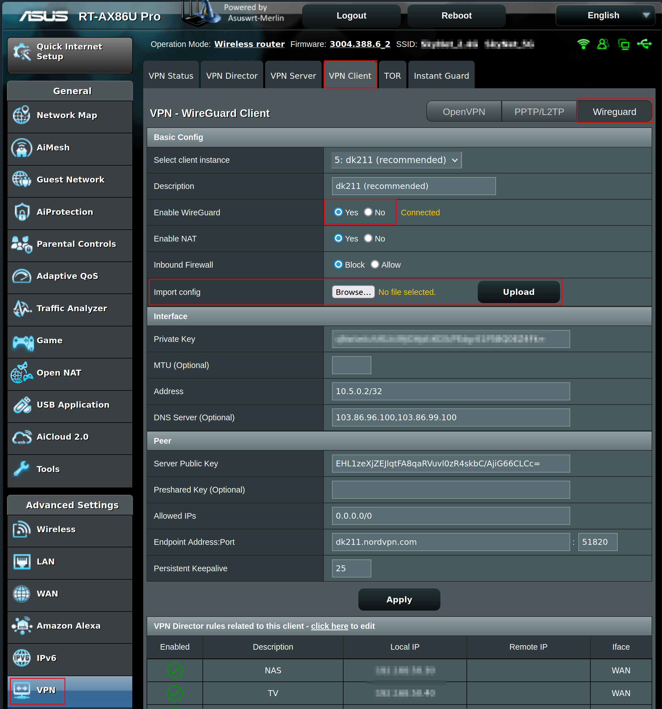
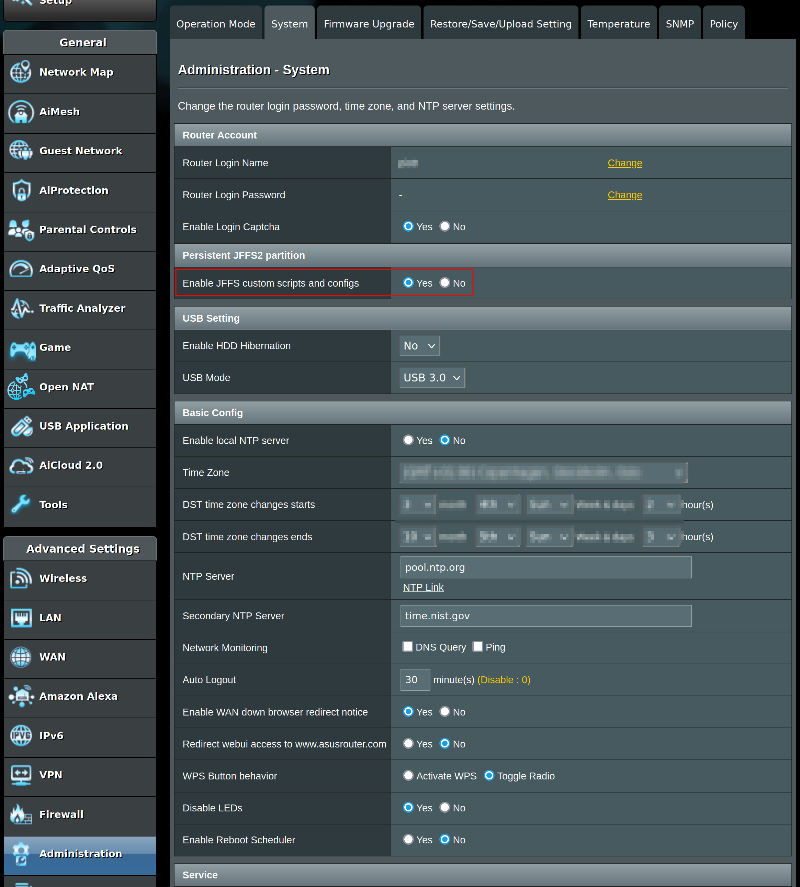
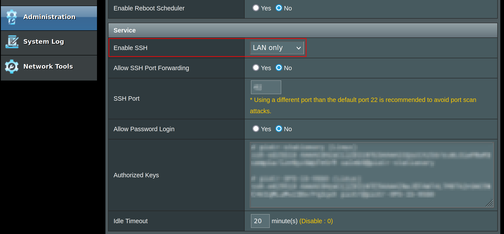

# asuswrt-merlin-nordvpn-wg-updater

Keep your [WireGuard](https://www.wireguard.com/) VPN client up to
date with the NordVPN [recommended
server](https://nordvpn.com/servers/tools/) on an ASUS router running
[Asuswrt-Merlin](https://www.asuswrt-merlin.net/) firmware.

## What?

A simple [user
script](https://github.com/RMerl/asuswrt-merlin.ng/wiki/User-scripts)
that can be used to keep a WireGuard NordVPN client up to date. This
work has been adapted from
[sfiorini/NordVPN-Wireguard](https://github.com/sfiorini/NordVPN-Wireguard)
(a script to obtain WireGuard config for NordVPN servers). It runs
periodically on your router, queries NordVPN API for the recommended
server, and modifies the client settings accordingly.

## How?

The script queries NordVPN API for recommended server and updates
`nvram` and `wg` settings corresponding to an instance of a client on
the router.

__The script intentionally only updates _enabled_ clients, so if you
disable a client, it will not update it to the recommended server__.

## Limitations / Requirements

For simplicity, setting up the script requires that you already have a
WireGuard NordVPN client set up on the router.

The installation script requires a minimum Asuswrt-Merlin version 388.

At the moment, setting a specific country, city or server group is not
supported (it might come later) -- the script just sets the client to
connect to the default recommended server, which is likely going to be
the server for your real location.
   
## Tested On

RT-AX86U Pro with Asuswrt-Merlin version 3004.388.6_2 

## Setup

### TL;DR

For those proficient in Asuswrt-Merlin management, just setup an
instance of NordVPN WireGuard client, and use the `install.sh` script
on the router.

### Detailed Instructions

1. Use
   [sfiorini/NordVPN-Wireguard](https://github.com/sfiorini/NordVPN-Wireguard)
   script, or a similar one, to obtain the initial WireGuard config
   file on your PC. Then upload it to the router via its web interface
   and enable the client. Note down the __instance number__ of the
   WireGuard VPN client; you'll need it during script installation later on.

   
   
   If you already have a client set up and want to test the script, I
   recommend setting up a separate client instance.

2. In the router web interface, enable JFFS on the Administration /
   System page
   
   

3. Enable SSH access

   

4. Open SSH session to the router from your PC (replace
   "router-login-name" with the one configured on Administration ->
   System -> Router Login Name of router's web UI):
   
   ```bash
   ssh router-login-name@192.168.50.1
   ```

5. Download and run the installation script

   ```bash
   wget https://raw.githubusercontent.com/Caleb9/asuswrt-merlin-nordvpn-wg-updater/main/install.sh

   sh install.sh
   ```

   The script will ask you for the client instance from step 1, that
   will be set to recommended server.
   
6. You can disable SSH access to the router via the web interface
   again if you don't use it for anything.

7. Enjoy an NordVPN client connecting to the recommended server on
   your router :).

## Uninstall

Download and run the uninstallation script in SSH session

```bash
wget https://raw.githubusercontent.com/Caleb9/asuswrt-merlin-nordvpn-wg-updater/main/uninstall.sh

sh uninstall.sh

rm uninstall.sh
```

---

What? Still here?! Well, I hope you'll find this work useful :). Feel
free to raise issues or report a working setup in
[Discussions](https://github.com/caleb9/asuswrt-merlin-nordvpn-wg-updater/discussions).
