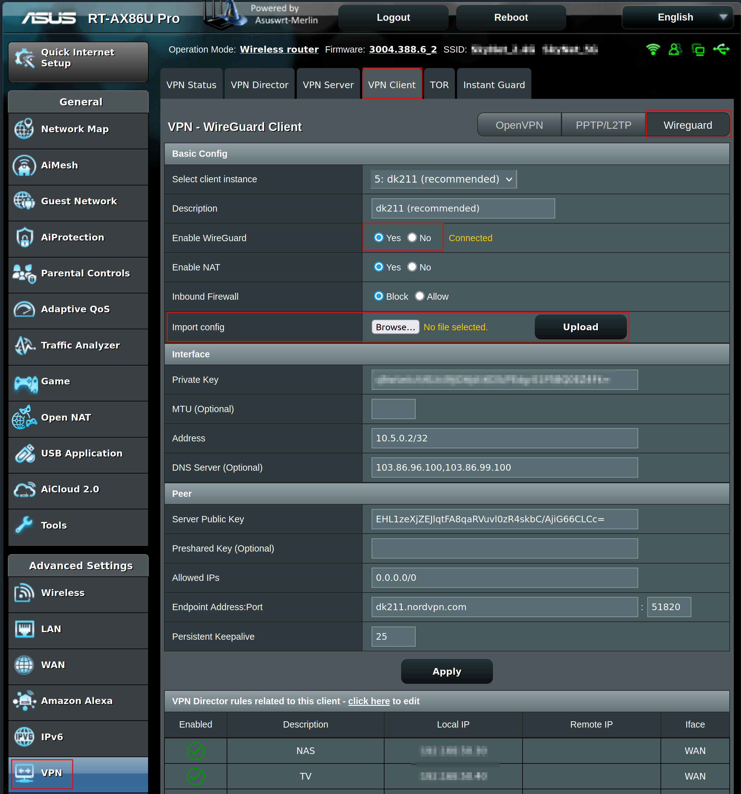
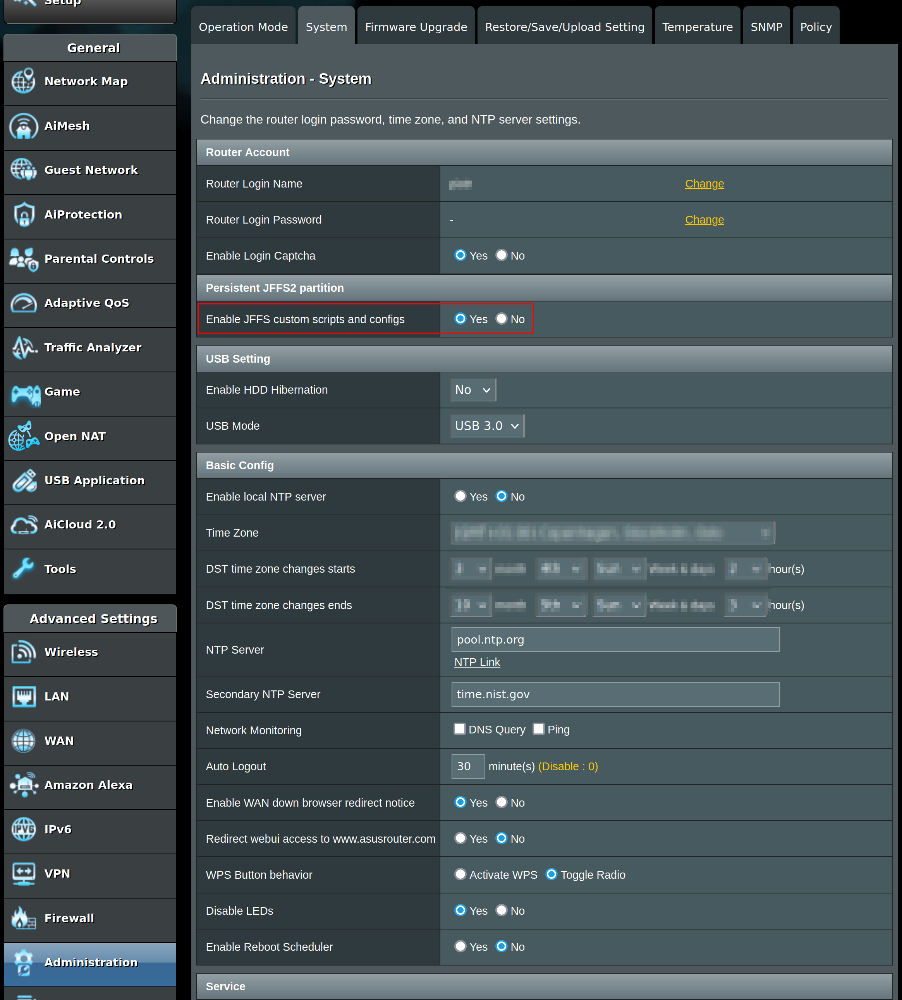
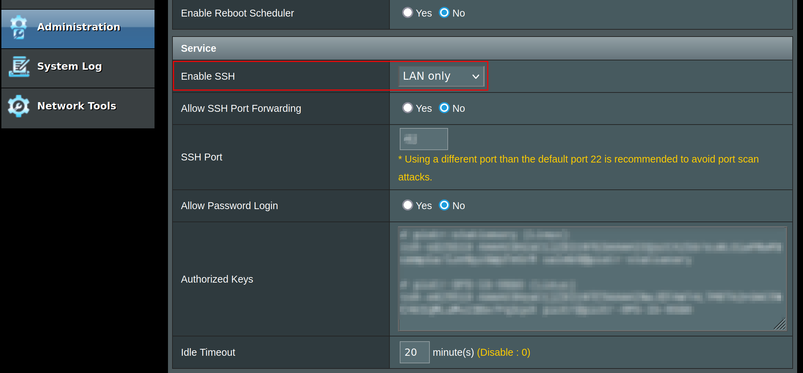

# asuswrt-merlin-nordvpn-wg-updater

Keep your [WireGuard](https://www.wireguard.com/) VPN client up to
date with the NordVPN [recommended
server](https://nordvpn.com/servers/tools/) on an ASUS router running
[Asuswrt-Merlin](https://www.asuswrt-merlin.net/) firmware.

## What?

A simple [user
script](https://github.com/RMerl/asuswrt-merlin.ng/wiki/User-scripts)
that can be used to keep a WireGuard NordVPN client up to date. This
work has been adapted from
[sfiorini/NordVPN-Wireguard](https://github.com/sfiorini/NordVPN-Wireguard)
(a script to obtain WireGuard config for NordVPN servers). It runs
periodically on your router, queries NordVPN API for the recommended
server, and modifies the client settings accordingly.

## How?

The script queries NordVPN API for recommended server and updates
`nvram` and `wg` settings corresponding to an instance of a client on
the router.

__The script intentionally only updates _enabled_ clients, so if you
disable a client, it will not update it to the recommended server__.

## Limitations / Requirements

For simplicity, setting up the script requires that you already have a
WireGuard NordVPN client set up on the router.

## Tested On

RT-AX86U Pro with Asuswrt-Merlin version 3004.388.6_2 

## Setup

### TL;DR

For those proficient in Asuswrt-Merlin management, just setup an
instance of NordVPN WireGuard client on the router, upload the
`nordvpn-updater.sh` script, download `jq` binary to `/opt/usr/bin/`
and schedule execution with a cron job.

### Detailed Instructions

1. Use
   [sfiorini/NordVPN-Wireguard](https://github.com/sfiorini/NordVPN-Wireguard)
   script, or a similar one, to obtain the initial WireGuard config
   file on your PC. Then upload it to the router via its web interface
   and enable the client. Note down the __instance number__ of the
   WireGuard VPN client; you'll need to pass it to the
   `nordvpn-updater.sh` script later on.

   
   
   If you already have a client set up and want to test the script, I
   recommend setting up a separate client instance.

2. In the router web interface, enable JFFS on the Administration /
   System page
   
   

3. Enable SSH access

   

4. The script depends on [jq](https://github.com/jqlang/jq) command,
   which is not available by default on Asuswrt-Merlin. SSH to the
   router and download [jq](https://github.com/jqlang/jq) to
   `/opt/usr/bin`. Make sure to select the file for the architecture
   matching your router's CPU:
   
   ```bash
   wget -O /opt/usr/bin/jq https://github.com/jqlang/jq/releases/download/jq-1.7.1/jq-linux-arm64
   ```
   
   Set executable permission on the file:
   
   ```bash
   chmod +x /opt/usr/bin/jq
   ```
   
   Confirm that it works with e.g., `jq --version`.
   
5. Upload the `nordvpn-updater.sh` script to the router (e.g., using
   `scp`) and put it in `/jffs/scripts`. Set executable permission on
   it with `chmod +x /jffs/scripts/nordvpn-updater.sh`.

6. It's a good time to test if everything works. In the SSH session,
   run the script with the client instance number from step 1. For
   example, for client 5 do:
   
   ```bash
   sh /jffs/scripts/nordvpn-updater.sh 5
   ```

   The output should say `Setting wgc5 to {recommended
   server}`. Confirm in the router's web interface in VPN -> VPN
   Client that the client instance has "Description" and "Endpoint
   Address:Port" fields updated accordingly.
   
7. Schedule periodic execution, e.g., with
   [`cru`](https://github.com/RMerl/asuswrt-merlin.ng/wiki/Scheduled-tasks-(cron-jobs)). For
   example, to update the `wgc5` client instance once every hour, do:
   
   ```bash
   cru a nordvpn-updater "00 * * * * /bin/sh /jffs/scripts/nordvpn-updater.sh 5 > /var/log/nordvpn-updater.log 2>&1"
   ```

   Note the `5` in the above command needs to be changed to your VPN
   client's instance number. The `/var/log/nordvpn-updater.log` file
   will then contain the log of the last execution for inspection if
   needed.

8. `cru` entries get reset on router reboot. To make the schedule
   persistent, you need to add the `cru` command to the end of
   `/jffs/scripts/services-start` file. E.g., using the `vi` editor:
   
   ```bash
   vi /jffs/scripts/services-start
   ```
   
   Press `i` and move down to the end of the file with arrow
   keys. Then type:
   
   ```
   cru a nordvpn-updater "00 * * * * /bin/sh /jffs/scripts/nordvpn-updater.sh 5 > /var/log/nordvpn-updater.log 2>&1"
   ```
   
   Press `ESC` button, followed by `:`, `w`, `q`, `ENTER` to save and
   quit. If you mess up, use `ESC`, `:`, `q`, `!`, `ENTER` to quit
   without saving and try again ;).
   
9. You can disable SSH access to the router via the web interface
   again if you don't use it for anything.
10. Enjoy an NordVPN client connecting to the recommended server on
    your router :).

## Uninstall

Remove the schedule and files:

```bash
cru d nordvpn-updater && rm /jffs/scripts/nordvpn-updater.sh /opt/usr/bin/jq /var/log/nordvpn-updater.log
```

Remove `cru` line from `/jffs/scripts/services-start` file (again with
`vi` press `i`, edit the file and then `ESC`, `:`, `w`, `q`, `ENTER`).

---

What? Still here?! Well, I hope you'll find this work useful :). Feel
free to raise issues or report a working setup in
[Discussions](https://github.com/Caleb9/asuswrt-merlin-nordvpn-wg-updater/discussions).
